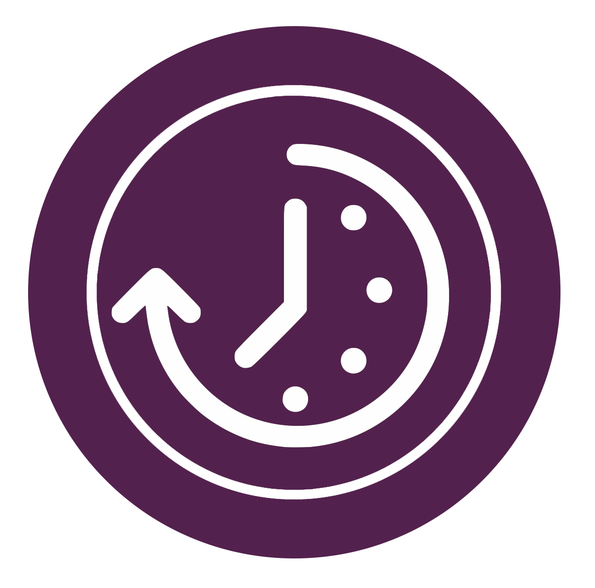

# Timeline

## Features
### Currently supported
- Display calendar with the today date.
- Add a new studding period.
- Display a marker contains number of studding periods.
- Display day time line when the day is selected.

### Planning to support
- Expand time line on slide up.
- Deleting period form the time line.
- Editing Period on the time line.
- Portrait & Landscape UI support.

